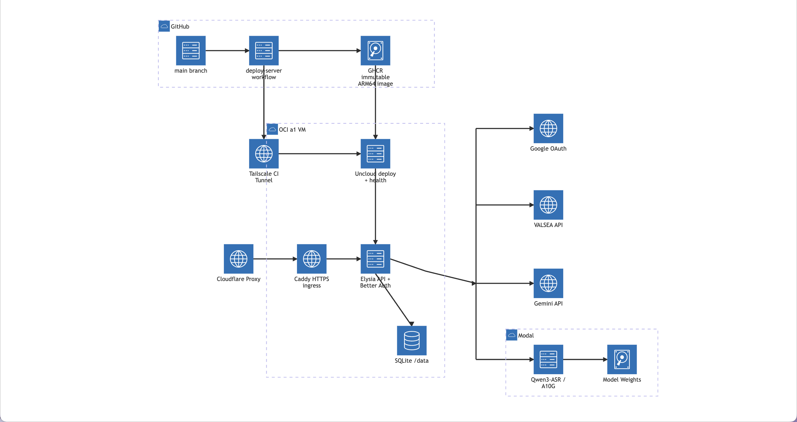

<p align="center">
  
</p>

<h1 align="center">Valsea</h1>

Valsea compares audio transcriptions from VALSEA, Gemini 3.5 Transcribe, and Qwen3-ASR-1.7B on Modal. The repository contains a TanStack Start web application, an Elysia server, shared authentication and database packages, and the Cloudflare web deployment definition.

## Demo Video

[youtu.be/L-nCA8ie3QQ](https://youtu.be/L-nCA8ie3QQ)

## Requirements

- Bun 1.4 or later
- Docker with Docker Compose

## Local development

```bash
bun install
cp apps/server/.env.example apps/server/.env
cp apps/web/.env.example apps/web/.env
bun run db:push
bun run dev
```

The API listens on `http://localhost:3000`. The web application listens on `http://localhost:3001`.

Production web application: https://app-valsea.rutam.dpdns.org

Modal Qwen transcription endpoint: https://rutambhagat-valsea--qwen3-asr-qwenasr-transcribe.modal.run

The endpoint requires a Modal proxy token in the `Authorization: Bearer $MODAL_PROXY_TOKEN` header.

Required server variables are documented in `apps/server/.env.example`. Keep all provider credentials in the server environment. The browser must not receive them.

## API documentation

- Local OpenAPI UI: `http://localhost:3000/openapi`
- Production OpenAPI UI: https://valsea.rutam.dpdns.org/openapi
- Production OpenAPI JSON: https://valsea.rutam.dpdns.org/openapi/json

## Backend architecture

The diagram shows the backend request path, external providers, and server deployment flow.



## Modal Qwen deployment

`apps/qwen-modal/src/qwen_modal/app.py` defines the Qwen service and its infrastructure in one Python module:

1. Modal builds a Python 3.12 image with FFmpeg, Qwen ASR, and PyTorch.
2. A persistent Modal Volume is mounted at `/cache`. Hugging Face downloads the model weights to this cache once, so a new container does not download them again.
3. A Modal class requests one A10G GPU. Its `@modal.enter` hook loads `Qwen/Qwen3-ASR-1.7B` in BF16 and moves it to GPU memory before Modal marks the container as ready.
4. An authenticated FastAPI endpoint accepts the audio body, runs transcription outside the event loop, and returns the text as JSON.

The deployment sets `max_containers=1` and does not set `min_containers`, so Modal can scale the service to zero when it is idle. This limits GPU cost but adds a cold start. The first request after scale-to-zero takes approximately 20 seconds because Modal must start the container and copy the cached weights into GPU memory. Requests to the same warm container skip initialization and are faster. The one-container limit also queues overlapping requests instead of adding GPU replicas.

Run the service from `apps/qwen-modal`:

```bash
uv sync
uv run poe modal-dev     # temporary development endpoint
uv run poe modal-deploy  # persistent deployment
```

See Modal's documentation for [container lifecycle hooks](https://modal.com/docs/guide/lifecycle-functions), [model-weight Volumes](https://modal.com/docs/guide/model-weights), and [cold-start controls](https://modal.com/docs/guide/cold-start).

## Production deployment

The server runs as an ARM64 Docker container on the OCI `a1` VM. Cloudflare sends proxied traffic for `valsea.rutam.dpdns.org` to Uncloud Caddy on the VM. Uncloud performs start-first replacement, gates each release on `/healthz`, and keeps the old healthy container active if the new container fails. SQLite data stays in `/var/lib/valsea`.

`.github/workflows/deploy-server.yml` performs these operations:

1. Run the repository checks.
2. Build a `linux/arm64` image with the immutable Git commit SHA.
3. Push the image to `ghcr.io/rutambhagat/valsea`.
4. Connect to `a1` through Tailscale.
5. Run the pinned Uncloud CLI against `a1` with `compose.yaml`.

The deploy job uses the `production` environment. Configure the application variables from `apps/server/.env.example` and these deployment secrets in that environment:

- `A1_SSH_KNOWN_HOSTS`
- `TS_OAUTH_CLIENT_ID`
- `TS_AUDIENCE`

The workflow uses its short-lived `GITHUB_TOKEN` for GHCR. The Tailscale OAuth client must permit the `tag:ci` device tag. The tailnet policy must permit `tag:ci` to reach `a1` on TCP port 22. Caddy obtains and renews the origin certificate automatically.

## Web deployment

The Cloudflare web deployment remains in `packages/infra/alchemy.run.ts` and does not provision OCI resources:

```bash
VITE_SERVER_URL=https://valsea.rutam.dpdns.org bun run deploy
```

## Checks

```bash
bun run check
bun run build
```

## Evaluation

The evaluation uses a versioned manifest of 10 fixed Mandarin-English code-switched utterances from MERaLiON's `Multitask-National-Speech-Corpus-v1` `ASR-PART4-Test` configuration. Each manifest entry pins the dataset row, reference text, duration, and audio SHA-256. These checks make a run fail if the upstream sample changes.

Mixed Error Rate (MER) measures transcription accuracy across both scripts. The scorer applies NFKC normalization, removes speaker tags, lowercases English, and tokenizes each Mandarin character and each English word. It then calculates Levenshtein edits over the reference tokens. The reported MER is `total edits / total reference tokens` across all successful samples, rather than an average of per-sample percentages.

Latency starts immediately before each provider request and ends when that request returns. It includes a Qwen cold start when one occurs. Gemini's 21-second quota pacing is outside the timer. Failed requests remain in the result but do not contribute to MER or latency percentiles.

With the provider credentials already configured in `apps/server/.env`:

```bash
cd apps/qwen-modal
uv run python scripts/benchmark.py --sample-count 5
```

Set `--sample-count` to an integer from 1 through 10. If you omit it, the command uses the first 5 samples. Selection always follows manifest order.

The command validates the selected samples against row metadata, WAV duration, and SHA-256, calls VALSEA, Modal/Qwen, and Gemini directly, and writes `benchmark_result.json`. The result includes the manifest version and selected sample IDs. VALSEA uses `language=english` with correction/tags disabled so the benchmark is reproducible on the Free plan; Qwen and Gemini receive no language hint, and Gemini runs in verbatim mode. Gemini requests are paced 21 seconds apart; that pacing time is excluded from latency.

Observed benchmark result from the latest run:

| Provider              |  MER ↓ | p50 latency | p95 latency |
| --------------------- | -----: | ----------: | ----------: |
| VALSEA                |  45.0% |      9.13 s |     10.85 s |
| Qwen3-ASR-1.7B        |  49.9% |      5.65 s |     13.38 s |
| Gemini 3.5 Transcribe | 48.95% |      6.21 s |      7.98 s |

On this fixed MERaLiON code-switch benchmark, VALSEA currently has the lowest transcription error rate, while Qwen has the lowest median provider-request latency.

Google documents Gemini API rate limits as **per project, not per API key**, across RPM/TPM/RPD dimensions; exceeding any active limit returns a rate-limit error. In the AI Studio project inspected during development, `gemini-3.5-transcribe` showed limits of **3 RPM, 10K TPM, and 25 RPD**. The benchmark API key may belong to a different project/account, so those numbers are an observed reference rather than a guarantee for the key used to reproduce the run. A project with prior transcription traffic can therefore return HTTP 429 during the benchmark even when the request itself is valid. Check the active limits for the API key's project in Google AI Studio and rerun after the quota window clears rather than treating a quota 429 as an ASR failure. See [Gemini API rate limits](https://ai.google.dev/gemini-api/docs/rate-limits).
